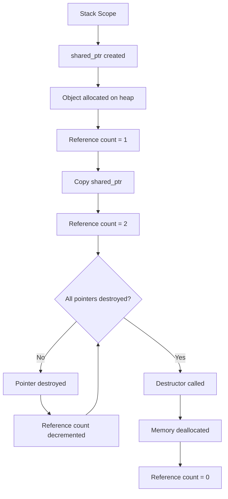
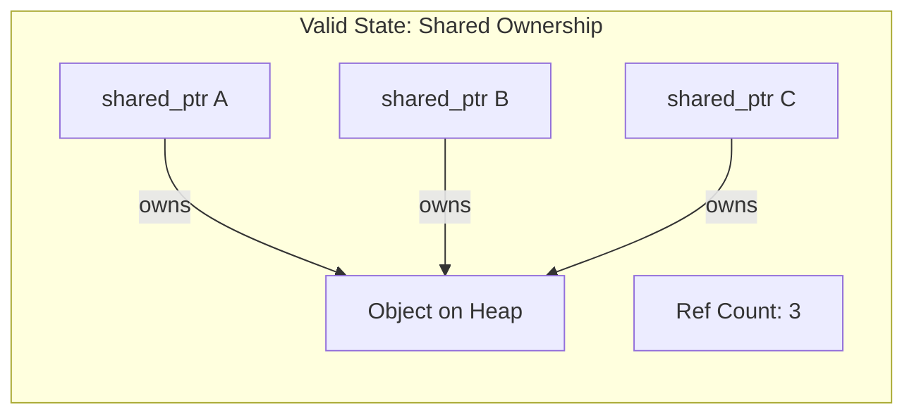
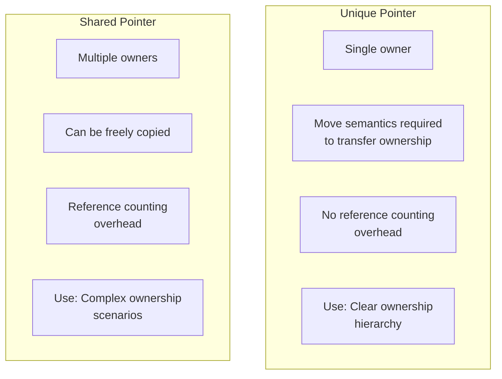
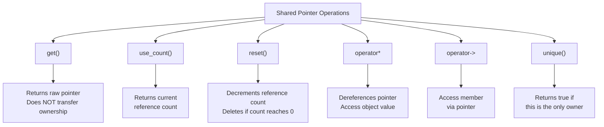
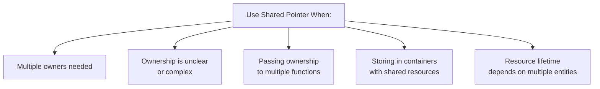
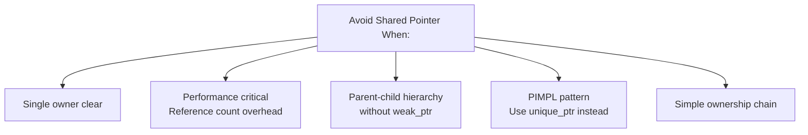
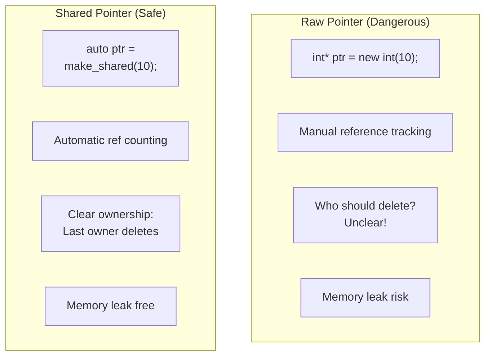

# Shared Pointers

A **Shared Pointer** (`std::shared_ptr`) is a smart pointer that allows multiple pointers to own the same dynamically allocated object. It uses reference counting to track how many pointers share ownership and automatically deletes the resource when the reference count reaches zero.

**Key Characteristics:**
- **Shared Ownership**: Multiple shared_ptr can own the same object
- **Reference Counting**: Automatically tracks number of owners
- **Automatic Deletion**: Memory freed when last owner is destroyed
- **RAII Principle**: Resource is managed automatically
- **Copy Semantics**: Can be copied freely, incrementing reference count
- **Thread-Safe Reference Count**: Atomic operations on reference count (though object access is not thread-safe)

---

## Visual Representation: Shared Pointer Lifecycle



---

## Shared Ownership Concept



---

## Reference Counting: How It Works

```mermaid
graph LR
    A["Step 1: Create ptr1<br/>shared_ptr ptr1<br/>Ref Count: 1"] -->|Copy| B["Step 2: Create ptr2<br/>shared_ptr ptr2 = ptr1<br/>Ref Count: 2"]
    B -->|Copy| C["Step 3: Create ptr3<br/>shared_ptr ptr3 = ptr1<br/>Ref Count: 3"]
    C -->|ptr2 destroyed| D["Step 4: ptr2 goes out of scope<br/>Ref Count: 2"]
    D -->|ptr1 destroyed| E["Step 5: ptr1 goes out of scope<br/>Ref Count: 1"]
    E -->|ptr3 destroyed| F["Step 6: ptr3 goes out of scope<br/>Ref Count: 0"]
    F --> G["Object deleted"]
```



---

## Comparison: Unique Pointer vs Shared Pointer



---

## Code Example: Basic Shared Pointer Usage

```cpp
#include <memory>
#include <iostream>

class Student {
public:
    Student(std::string name) : name(name) {
        std::cout << "Student created: " << name << std::endl;
    }
    ~Student() {
        std::cout << "Student destroyed: " << name << std::endl;
    }
    void introduce() {
        std::cout << "Hi, I'm " << name << std::endl;
    }
private:
    std::string name;
};

int main() {
    // Creating a shared pointer
    std::shared_ptr<Student> ptr1 = std::make_shared<Student>("Alice");
    
    std::cout << "Reference count: " << ptr1.use_count() << std::endl; // Output: 1
    
    // Creating another shared pointer from ptr1
    std::shared_ptr<Student> ptr2 = ptr1;
    
    std::cout << "Reference count: " << ptr1.use_count() << std::endl; // Output: 2
    std::cout << "Reference count: " << ptr2.use_count() << std::endl; // Output: 2
    
    // Using the shared pointers
    ptr1->introduce();
    ptr2->introduce();
    
    // ptr1 goes out of scope
    {
        std::shared_ptr<Student> ptr3 = ptr1;
        std::cout << "Reference count inside block: " << ptr1.use_count() << std::endl; // Output: 3
    }
    
    std::cout << "Reference count after block: " << ptr1.use_count() << std::endl; // Output: 2
    
    // ptr2 goes out of scope
    ptr2.reset();
    std::cout << "Reference count after reset: " << ptr1.use_count() << std::endl; // Output: 1
    
    // Memory automatically freed when ptr1 goes out of scope
    return 0;
}

/* Output:
   Student created: Alice
   Reference count: 1
   Reference count: 2
   Reference count: 2
   Hi, I'm Alice
   Hi, I'm Alice
   Reference count inside block: 3
   Reference count after block: 2
   Reference count after reset: 1
   Student destroyed: Alice
*/
```

---

## Key Operations with Shared Pointers



---

## Reference Count Tracking Example

```mermaid
sequenceDiagram
    participant Main
    participant ptr1
    participant ptr2
    participant ptr3
    participant Heap
    
    Main->>ptr1: Create shared_ptr
    ptr1->>Heap: Allocate Object
    Note over ptr1: Ref Count: 1
    
    Main->>ptr2: ptr2 = ptr1
    Note over ptr1,ptr2: Ref Count: 2
    
    Main->>ptr3: ptr3 = ptr1
    Note over ptr1,ptr2,ptr3: Ref Count: 3
    
    Main->>ptr2: ptr2 goes out of scope
    Note over ptr1,ptr3: Ref Count: 2
    
    Main->>ptr3: ptr3.reset()
    Note over ptr1: Ref Count: 1
    
    Main->>ptr1: ptr1 goes out of scope
    Note over Heap: Object deleted, Ref Count: 0
```

---

## Shared Pointers in Collections

```cpp
std::vector<std::shared_ptr<Student>> students;

// Add objects
students.push_back(std::make_shared<Student>("Alice"));
students.push_back(std::make_shared<Student>("Bob"));
students.push_back(std::make_shared<Student>("Charlie"));

// Each object can have multiple owners
std::shared_ptr<Student> favoriteStudent = students[0];

std::cout << "Reference count for Alice: " << students[0].use_count() << std::endl; // Output: 2

// Access
for (auto& student : students) {
    student->introduce();
}

// Automatic cleanup when vector and favoriteStudent are destroyed
```

**Visual Representation:**

```mermaid
graph LR
    A["Vector"] --> B["shared_ptr 0"]
    A --> C["shared_ptr 1"]
    A --> D["shared_ptr 2"]
    
    B -->|owns| E["Object: Alice"]
    C -->|owns| F["Object: Bob"]
    D -->|owns| G["Object: Charlie"]
    
    H["favoriteStudent"] -->|owns| E
    
    Note over B,H: Alice has Ref Count: 2
```

---

## Code Example: Shared Pointer with Collections

```cpp
#include <memory>
#include <vector>
#include <iostream>

class Team {
public:
    Team(std::string name) : name(name) {
        std::cout << "Team created: " << name << std::endl;
    }
    ~Team() {
        std::cout << "Team destroyed: " << name << std::endl;
    }
    
    void addMember(std::shared_ptr<std::string> member) {
        members.push_back(member);
    }
    
    void displayMembers() {
        std::cout << "Team " << name << " members: ";
        for (auto& member : members) {
            std::cout << *member << " ";
        }
        std::cout << std::endl;
    }
    
private:
    std::string name;
    std::vector<std::shared_ptr<std::string>> members;
};

int main() {
    std::shared_ptr<std::string> alice = std::make_shared<std::string>("Alice");
    std::shared_ptr<std::string> bob = std::make_shared<std::string>("Bob");
    
    {
        Team team("A");
        team.addMember(alice);
        team.addMember(bob);
        team.displayMembers();
        // Team destroyed here, but alice and bob still exist
    }
    
    std::cout << "Alice ref count: " << alice.use_count() << std::endl; // Output: 1
    std::cout << "Bob ref count: " << bob.use_count() << std::endl;     // Output: 1
    
    return 0;
}
```

---

## When to Use Shared Pointers



---

## When NOT to Use Shared Pointers



---

## Performance Considerations

| Aspect | Details |
|--------|---------|
| **Reference Count Overhead** | Requires separate control block on heap |
| **Atomic Operations** | Reference count updates are atomic (thread-safe) |
| **Copy Operations** | Copying increments reference count |
| **Move Operations** | More efficient than copy (like unique_ptr) |
| **Memory Footprint** | Larger than unique_ptr (2 pointers vs 1) |

---

## Comparison: Raw Pointer vs Shared Pointer



---

## Best Practices

| Practice | Explanation |
|----------|-------------|
| **Use `std::make_shared`** | More efficient than `new`, creates single allocation |
| **Prefer unique_ptr** | Use shared_ptr only when multiple owners needed |
| **Avoid raw pointers** | Don't extract with `.get()` and delete manually |
| **Check with `use_count()`** | To debug reference count issues |
| **Don't over-use** | shared_ptr adds overhead; clarify if multiple owners are needed |
| **Move when possible** | Use move semantics to reduce reference count operations |

---

## Avoiding Circular References

Circular references can cause memory leaks with shared pointers. Consider using `std::weak_ptr` for back-references in parent-child relationships. See the **Weak Pointers** documentation for detailed information on handling circular references.

---

## Summary

Shared pointers provide:
- ✅ **Automatic memory management with shared ownership**
- ✅ **Reference counting for proper cleanup**
- ✅ **Exception safety**
- ✅ **Clear semantics for shared resources**
- ✅ **Prevention of memory leaks in complex scenarios**

Use shared_ptr when multiple owners genuinely need to share a resource, but prefer unique_ptr as your default for clearer ownership semantics!
