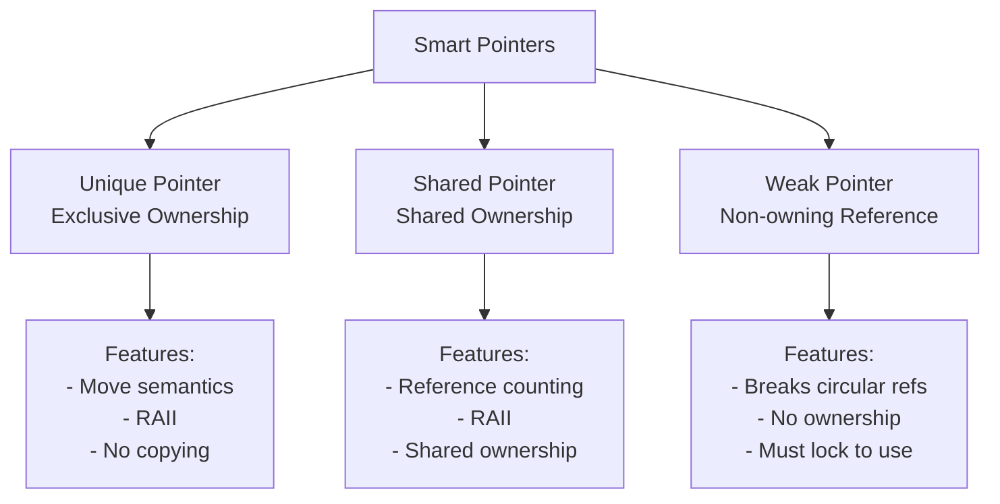

#Smart Pointers

In C++, **Pointers** are same as the variables, which stores the memory address of the another variable. This is the standard defintion of Pointers. So this raw pointers isn't fail because they are in [...]

So, In modern C++ starting from C++11, it relies heavily on **RAII (Resource Acquisition is Initialization)**, This means an object's lifetime is tightly bound to its stack scope. When a stack object [...]

**Smart Pointers** are wrappers around the raw pointer that adds up the layer of intelligence, primarily by managing the lifetime of object they point to. And They automatically deallocates the memory[...]

They are defined in the **std** namespace in the <memory> header file. They are designed to be as efficient as possible both in terms of memory and performance.

By wrapping the raw pointers inside the smart pointer classes, we turn memory management from an active developer chore into a passive compiler guarantee (so Smart Pointers is perfect example of **Encapsulation**).

## Types of Smart Pointers

1. Unique pointer
2. Shared pointer
3. Weak pointer

## Smart Pointers Hierarchy

