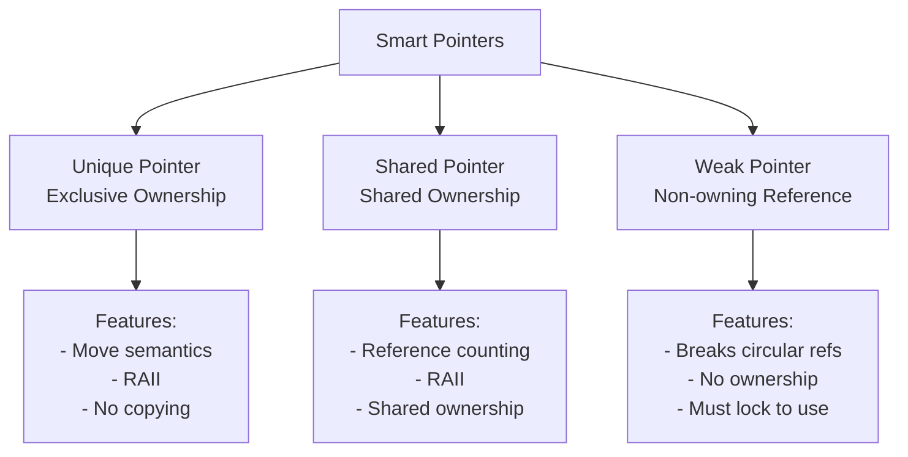

# Smart Pointers

In C++, **Pointers** are same as the variables, which stores the memory address of the another variable And allocate the new objects on the heap memory. This is the standard defintion of Pointers. So this raw pointers isn't fail because they are inherently bad—it's because they lack semantic meaning. A raw pointer tells you where something is, but it never tells you who is responsible for cleaning it up.

So, In modern C++ starting from C++11, it relies heavily on **RAII (Resource Acquisition is Initialization)**, This means an object's lifetime is tightly bound to its stack scope. When a stack object dies, its destructor automatically cleans up its heap resources.

**Smart Pointers** are wrappers around the raw pointer that adds up the layer of intelligence, primarily by managing the lifetime of object they point to. And used to help ensure that programs are free of memory and resource leaks are exception safe.

They are defined in the **std** namespace in the <memory> header file. They are designed to be as efficient as possible both in terms of memory and performance.

By wrapping the raw pointers inside the smart pointer classes, we turn memory management from an active developer chore into a passive compiler guarantee (so Smart Pointers is perfect example of **Encapsulation**).

## Real-World Example to understand it better
Imagine you want to drive a car. There are three distinct ways you can interact with it, mapping perfectly to C++ pointer semantics:

**1. The Sublet (Raw Pointer T):** A friend hands you a set of car keys but doesn't tell you if the car is rented, borrowed, or stolen. When you are done driving, do you park it? Do you scrap it? If you accidentally scrap it (delete), your friend might face a catastrophic crash next time they try to drive it. If you do nothing, the car sits abandoned forever (Memory Leak).

**2. The Private Lease (std::unique_ptr):** You lease a car exclusively. The keys belong to you and only you. When your lease contract expires (goes out of scope), the car is automatically returned to the dealership and recycled. No one else can drive it unless you explicitly hand over the entire lease contract to them.

**3. The Commuter Rideshare (std::shared_ptr & std::weak_ptr):** A group of coworkers carpools together. The car stays running as long as there is at least one passenger inside (Strong Reference Count > 0). The last person to leave the car turns off the engine and locks it up for good (delete). Meanwhile, a mechanic tracks the car via GPS (std::weak_ptr) to see if it still exists, but doesn't prevent the commuters from finishing their ride.

## Smart Pointers Hierarchy

## Types of Smart Pointers

### Unique Pointer

**File:** [Unique pointers.md](https://github.com/sushmitassathe25/Cpp-Advanced/blob/main/Unique%20pointers.md)

`std::unique_ptr` is a smart pointer that exclusively owns and manages memory. 

### Shared Pointer

**File:** [Shared pointer.md](https://github.com/sushmitassathe25/Cpp-Advanced/blob/main/Shared%20pointers.md)

`std::shared_ptr` is a smart pointer that allows multiple pointers to share ownership of the same memory. 

### Weak Pointer

**File:** [Weak pointer.md](https://github.com/sushmitassathe25/Cpp-Advanced/blob/main/Weak%20pointers.md)

`std::weak_ptr` is a smart pointer that holds a non-owning reference to an object managed by a `shared_ptr`. 

## Comparison Table

| Feature | unique_ptr | shared_ptr | weak_ptr |
|---------|-----------|-----------|----------|
| Ownership | Exclusive | Shared | None (non-owning) |
| Reference Counting | No | Yes | No |
| Copyable | No | Yes | Yes |
| Movable | Yes | Yes | Yes |
| Thread-safe | Pointer only | Reference count | No |
| Memory Overhead | Minimal | Moderate (ref count) | Minimal |
| Use for Ownership | ✓ | ✓ | ✗ |
| Use to Break Cycles | ✗ | ✗ | ✓ |

---
