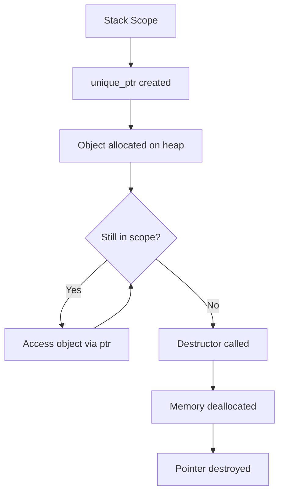
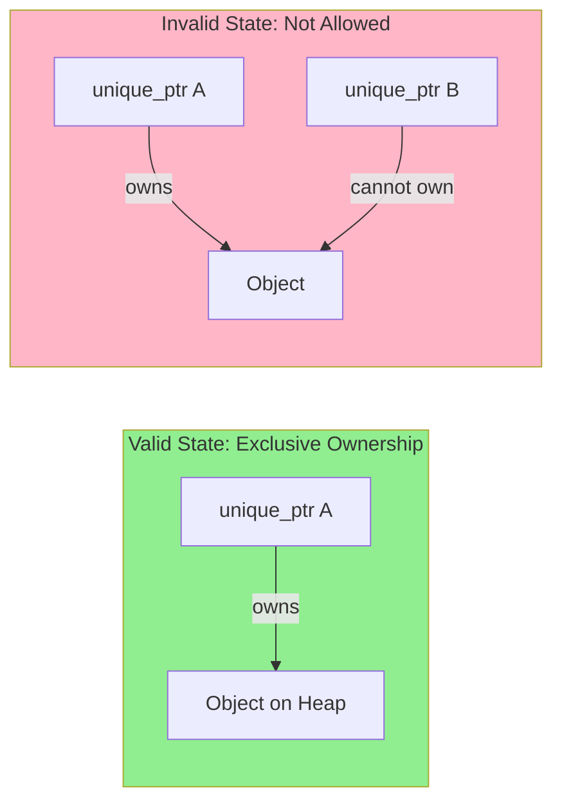
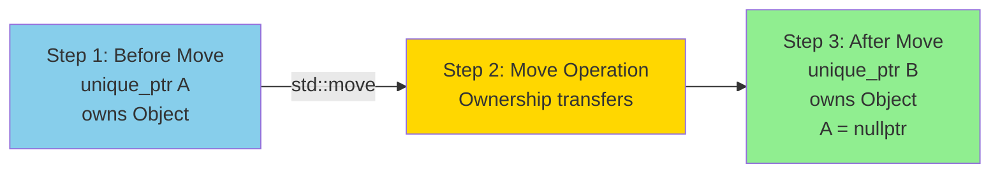
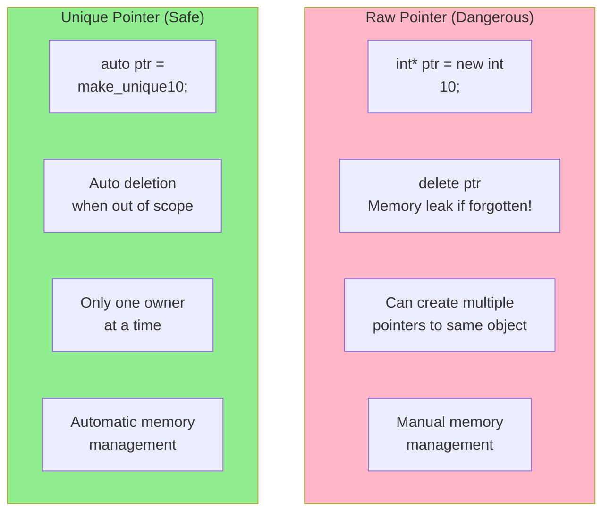
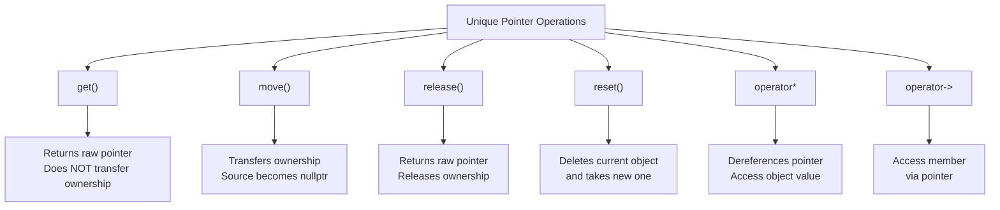
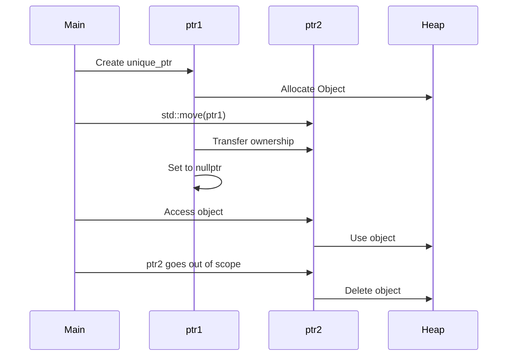
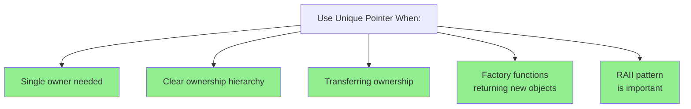
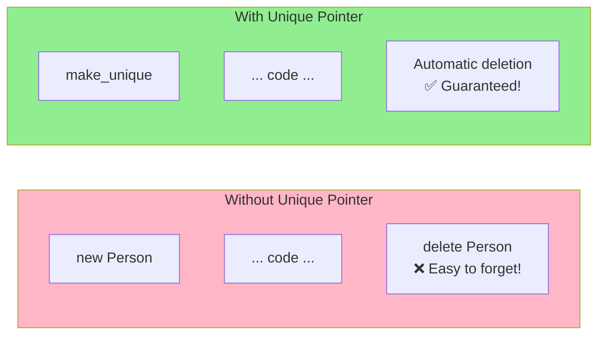
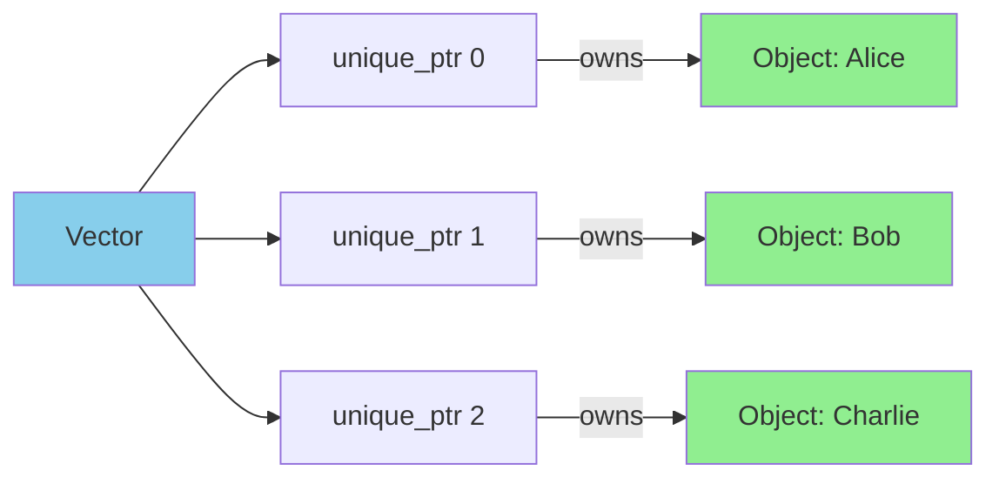

# Unique Pointers


# Unique Pointers

As name suggests it is used for strict **Exclusive Ownership** i.e only one pointer can manage the resource. Copying is strictly forbidden by the compiler, though ownership can be transferred/moved.

std::unique_ptr is the simplest and most efficient smart pointer in modern C++. When the piece of heap memory is wrapped inside the unique_ptr, then that pointer becomes the sole owner of that memory and no other pointer can share or copy it.

A unique_ptr can only be moved with std::move. This means that the ownership of the memory resources is transferred to another unique_ptr and the original unique_ptr is no longer owns it.

unique_ptr ties the lifetime of heap allocation directly to the lifetime of stack variable using the RAII. If your functiom exists early because of return statement or thrown exception, C++ compiler guarantees that the unique_ptr destructor will run preventing any chances of a memory leak.   


## What is a Unique Pointer?

A **Unique Pointer** (`std::unique_ptr`) is a smart pointer that maintains exclusive ownership of a dynamically allocated object. It ensures that only one unique pointer can own a resource at any given time. When the unique pointer goes out of scope, it automatically deallocates the memory.

**Key Characteristics:**
- **Exclusive Ownership**: Only one unique_ptr can own the object at a time
- **Move Semantics**: Ownership can be transferred using move semantics
- **RAII Principle**: Resource is freed when the pointer goes out of scope
- **No Copying**: Copying is explicitly deleted to maintain uniqueness
- **Zero-Overhead**: No runtime performance cost compared to raw pointers

---

## Visual Representation: Unique Pointer Lifecycle



---

## Exclusive Ownership Concept



---

## Move Semantics: Transferring Ownership



---

## Comparison: Raw Pointer vs Unique Pointer



---

## Code Example: Basic Unique Pointer Usage

```cpp
#include <memory>
#include <iostream>

class Person {
public:
    Person(std::string name) : name(name) {
        std::cout << "Person created: " << name << std::endl;
    }
    ~Person() {
        std::cout << "Person destroyed: " << name << std::endl;
    }
    void greet() {
        std::cout << "Hello, I'm " << name << std::endl;
    }
private:
    std::string name;
};

int main() {
    // Creating a unique pointer
    std::unique_ptr<Person> ptr = std::make_unique<Person>("Alice");
    
    // Using the unique pointer
    ptr->greet();
    
    // Transferring ownership (Move)
    std::unique_ptr<Person> ptr2 = std::move(ptr);
    
    // ptr is now nullptr
    if (!ptr) {
        std::cout << "ptr is now empty" << std::endl;
    }
    
    ptr2->greet();
    
    // Memory automatically freed when ptr2 goes out of scope
    return 0;
}

/* Output:
   Person created: Alice
   ptr is now empty
   Hello, I'm Alice
   Person destroyed: Alice
*/
```

---

## Key Operations with Unique Pointers



---

## Ownership Transfer Example



---

## When to Use Unique Pointers



---

## Memory Management: Before and After



---

## Best Practices

| Practice | Explanation |
|----------|-------------|
| **Use `std::make_unique`** | Safer than `new`, exception-safe |
| **Use `std::move`** | Transfer ownership explicitly |
| **Avoid manual `delete`** | Never manually delete unique_ptr managed memory |
| **Check for nullptr** | Before dereferencing after move operations |
| **Return by value** | When transferring ownership from functions |
| **Use `get()` for passing** | When you need to pass to functions not managing ownership |

---

## Unique Pointer in Collections

```cpp
std::vector<std::unique_ptr<Person>> people;

// Add objects
people.push_back(std::make_unique<Person>("Alice"));
people.push_back(std::make_unique<Person>("Bob"));

// Access
for (auto& person : people) {
    person->greet();
}

// Automatic cleanup when vector is destroyed
```

**Visual Representation:**



---

## Summary

Unique pointers provide:
- ✅ **Automatic memory management**
- ✅ **Exception safety**
- ✅ **Clear ownership semantics**
- ✅ **Zero-cost abstraction**
- ✅ **Prevention of memory leaks**

Use them as your default choice for dynamic memory allocation in modern C++!
