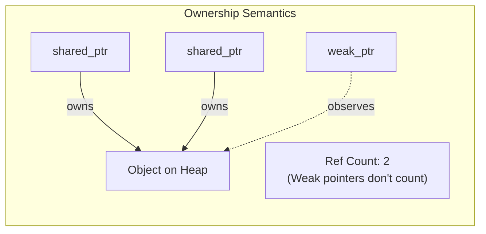
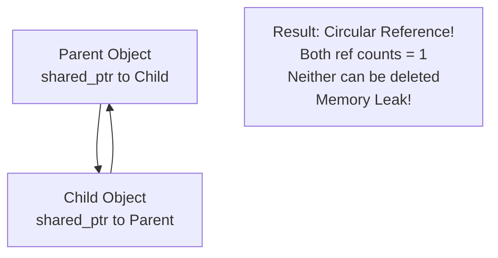
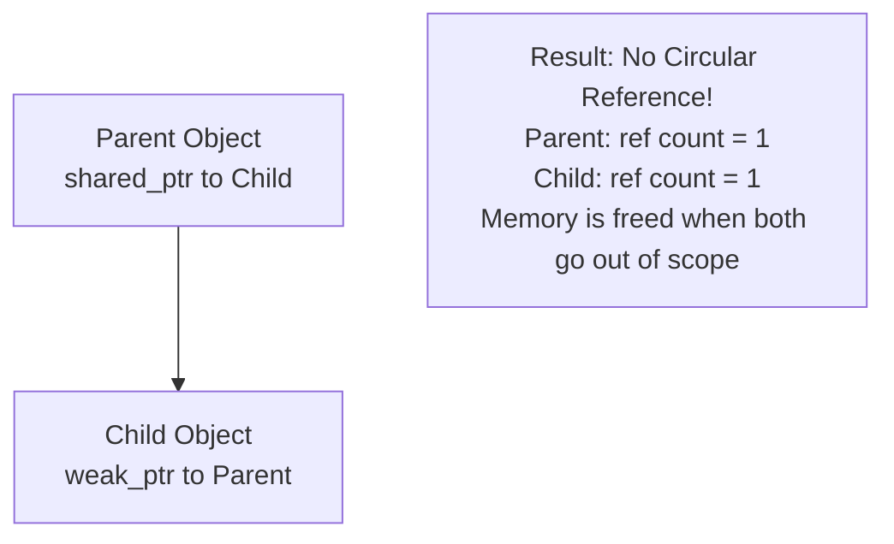
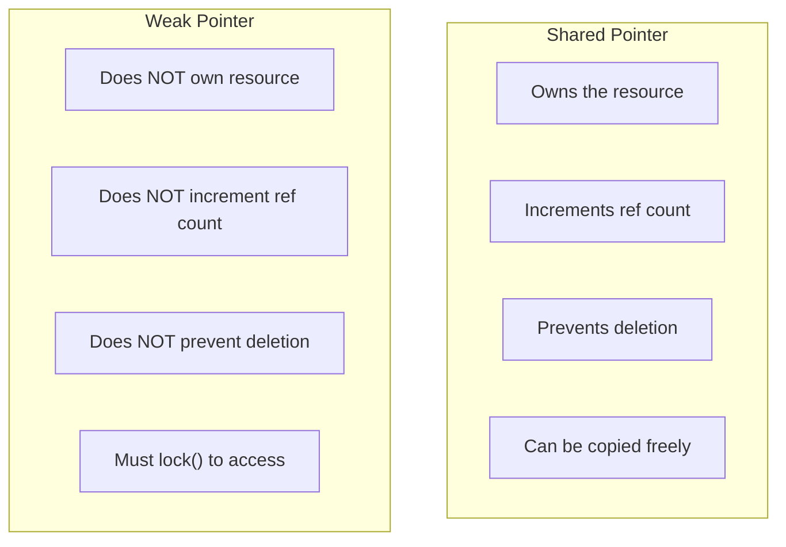
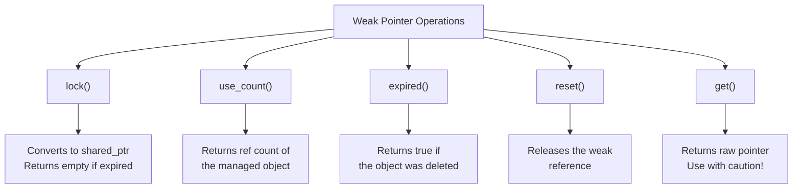
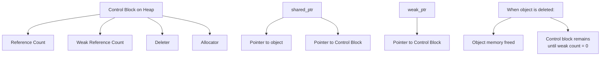
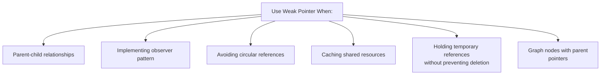
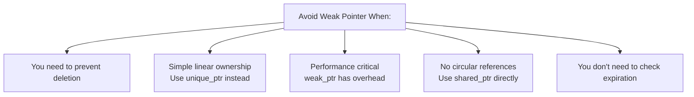
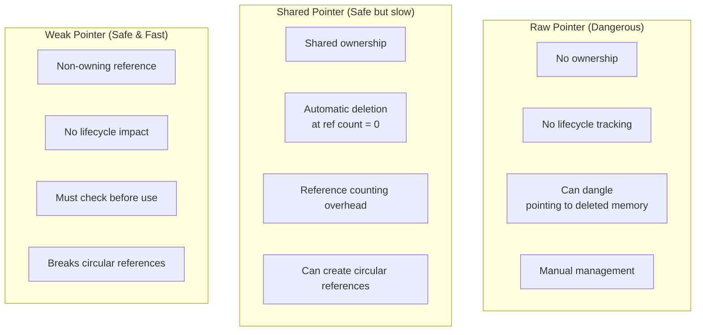

# Weak Pointers

A **Weak Pointer** (`std::weak_ptr`) is a smart pointer that holds a non-owning reference to an object managed by `std::shared_ptr`. Unlike shared pointers, weak pointers do not participate in reference counting and do not prevent the object from being deleted.

Weak pointers are primarily used to break circular references that can occur between shared pointers, which would otherwise lead to memory leaks. A weak pointer must be converted to a shared pointer (by calling `lock()`) before it can be used to access the object.

**Key Characteristics:**
- **Non-Owning Reference**: Does NOT increment the reference count
- **Breaking Circular References**: Prevents memory leaks in cyclic dependencies
- **Must Convert to Shared Pointer**: Use `.lock()` to access the managed object
- **Automatic Invalidation**: Automatically becomes invalid when the object is deleted
- **Observer Pattern**: Ideal for implementing observer/listener patterns
- **Safe Access**: Can check if object still exists before dereferencing

---

## Visual Representation: Weak Pointer Concept



---

## The Circular Reference Problem

### Memory Leak with Shared Pointers



### Solution with Weak Pointers



---

## Weak Pointer Lifecycle

```mermaid
graph TD
    A["weak_ptr created"] --> B["Observes shared_ptr<br/>No ownership"]
    B --> C["Object still owned<br/>by shared_ptr"]
    C --> D{"Try to use<br/>weak_ptr?"}
    D -->|Call lock()| E["Conversion to<br/>shared_ptr"]
    E --> F{"Conversion<br/>successful?"}
    F -->|Yes| G["Access the object"]
    F -->|No| H["Returns nullptr<br/>shared_ptr"]
    D -->|shared_ptr destroyed| I["weak_ptr becomes<br/>invalid"]
    I --> J["lock() returns<br/>empty shared_ptr"]
```

---

## Weak Pointer vs Shared Pointer: Reference Counting

```mermaid
graph LR
    A["Step 1: Create shared_ptr ptr1<br/>Ref Count: 1<br/>Weak Count: 0"] -->|weak_ptr wptr = ptr1| B["Step 2: Create weak_ptr wptr<br/>Ref Count: 1<br/>Weak Count: 1"]
    B -->|shared_ptr ptr2 = ptr1| C["Step 3: Create shared_ptr ptr2<br/>Ref Count: 2<br/>Weak Count: 1"]
    C -->|ptr2.reset()| D["Step 4: ptr2 released<br/>Ref Count: 1<br/>Weak Count: 1"]
    D -->|ptr1.reset()| E["Step 5: ptr1 released<br/>Ref Count: 0<br/>Object DELETED<br/>Weak Count: 1 (but invalid)"]
    E -->|wptr.lock()| F["Step 6: Try lock()<br/>Returns empty shared_ptr<br/>Cannot access object"]
```

---

## Comparison: Weak Pointer vs Shared Pointer



---

## Code Example: Circular Reference Problem

```cpp
#include <memory>
#include <iostream>
#include <string>

using namespace std;

class Child;

class Parent {
public:
    Parent(const string& name) : name_(name) {
        cout << "Parent created: " << name << endl;
    }
    
    ~Parent() {
        cout << "Parent destroyed: " << name << endl;
    }
    
    void setChild(shared_ptr<Child> child) {
        child_ = child;
    }
    
    void greet() const {
        cout << "Hi, I'm parent " << name_ << endl;
    }
    
private:
    string name_;
    shared_ptr<Child> child_;  // Holds shared ownership of child
};

class Child {
public:
    Child(const string& name) : name_(name) {
        cout << "Child created: " << name << endl;
    }
    
    ~Child() {
        cout << "Child destroyed: " << name << endl;
    }
    
    void setParent(shared_ptr<Parent> parent) {
        parent_ = parent;  // PROBLEM: Circular reference!
    }
    
    void greet() const {
        cout << "Hi, I'm child " << name_ << endl;
    }
    
private:
    string name_;
    shared_ptr<Parent> parent_;  // Creates circular reference
};

int main() {
    {
        shared_ptr<Parent> parent = make_shared<Parent>("John");
        shared_ptr<Child> child = make_shared<Child>("Alice");
        
        parent->setChild(child);
        child->setParent(parent);
        
        cout << "Parent ref count: " << parent.use_count() << endl;  // Output: 2
        cout << "Child ref count: " << child.use_count() << endl;    // Output: 2
        
        // Both go out of scope here
        // But they are NOT deleted! (Memory Leak)
        // parent's ref count drops to 1 (child still holds reference)
        // child's ref count drops to 1 (parent still holds reference)
    }
    
    cout << "End of program" << endl;  // Destructors never called!
    // MEMORY LEAK! Both objects remain in memory
    return 0;
}

/* Output:
   Parent created: John
   Child created: Alice
   Parent ref count: 2
   Child ref count: 2
   End of program
   (Destructors NOT called - MEMORY LEAK!)
*/
```

---

## Code Example: Using Weak Pointers to Fix Circular References

```cpp
#include <memory>
#include <iostream>
#include <string>

using namespace std;

class Child;

class Parent {
public:
    Parent(const string& name) : name_(name) {
        cout << "Parent created: " << name << endl;
    }
    
    ~Parent() {
        cout << "Parent destroyed: " << name << endl;
    }
    
    void setChild(shared_ptr<Child> child) {
        child_ = child;
    }
    
    void greet() const {
        cout << "Hi, I'm parent " << name_ << endl;
    }
    
private:
    string name_;
    shared_ptr<Child> child_;  // Owns the child
};

class Child {
public:
    Child(const string& name) : name_(name) {
        cout << "Child created: " << name << endl;
    }
    
    ~Child() {
        cout << "Child destroyed: " << name << endl;
    }
    
    void setParent(shared_ptr<Parent> parent) {
        parent_ = parent;  // Use weak_ptr instead!
    }
    
    void greetParent() const {
        // Convert weak_ptr to shared_ptr using lock()
        if (auto parent = parent_.lock()) {
            cout << "Child greeting parent: ";
            parent->greet();
        } else {
            cout << "Parent no longer exists" << endl;
        }
    }
    
    void greet() const {
        cout << "Hi, I'm child " << name_ << endl;
    }
    
private:
    string name_;
    weak_ptr<Parent> parent_;  // SOLUTION: Use weak_ptr for back-reference
};

int main() {
    {
        shared_ptr<Parent> parent = make_shared<Parent>("John");
        shared_ptr<Child> child = make_shared<Child>("Alice");
        
        parent->setChild(child);
        child->setParent(parent);
        
        cout << "Parent ref count: " << parent.use_count() << endl;  // Output: 1
        cout << "Child ref count: " << child.use_count() << endl;    // Output: 1
        
        child->greetParent();
        
        // Both go out of scope here
        // Child is deleted first (ref count drops to 0)
        // Parent is deleted next (ref count drops to 0)
    }
    
    cout << "End of program" << endl;
    return 0;
}

/* Output:
   Parent created: John
   Child created: Alice
   Parent ref count: 1
   Child ref count: 1
   Child greeting parent: Hi, I'm parent John
   Child destroyed: Alice
   Parent destroyed: John
   End of program
*/
```

---

## Key Operations with Weak Pointers



---

## Code Example: Weak Pointer Operations

```cpp
#include <memory>
#include <iostream>

using namespace std;

class Resource {
public:
    Resource(int value) : value_(value) {
        cout << "Resource created: " << value << endl;
    }
    
    ~Resource() {
        cout << "Resource destroyed: " << value_ << endl;
    }
    
    int getValue() const {
        return value_;
    }
    
private:
    int value_;
};

int main() {
    weak_ptr<Resource> wptr;
    
    {
        // Create a shared pointer
        shared_ptr<Resource> sptr = make_shared<Resource>(42);
        
        // Create a weak pointer from shared pointer
        wptr = sptr;
        
        cout << "Resource ref count: " << sptr.use_count() << endl;      // Output: 1
        cout << "Weak pointer expired: " << wptr.expired() << endl;      // Output: 0 (false)
        
        // lock() to access the object
        if (auto locked = wptr.lock()) {
            cout << "Locked successfully!" << endl;
            cout << "Value: " << locked->getValue() << endl;             // Output: 42
            cout << "Ref count after lock: " << sptr.use_count() << endl; // Output: 2
        }
        
        cout << "Ref count after lock destroyed: " << sptr.use_count() << endl; // Output: 1
        
        // sptr goes out of scope here
        // Resource is deleted
    }
    
    cout << "Outside block - checking weak_ptr:" << endl;
    
    // Now try to access through weak pointer
    cout << "Weak pointer expired: " << wptr.expired() << endl;  // Output: 1 (true)
    
    if (auto locked = wptr.lock()) {
        cout << "Successfully locked!" << endl;
    } else {
        cout << "Cannot lock - object has been deleted!" << endl;  // This prints
    }
    
    cout << "Use count: " << wptr.use_count() << endl;  // Output: 0
    
    return 0;
}

/* Output:
   Resource created: 42
   Resource ref count: 1
   Weak pointer expired: 0
   Locked successfully!
   Value: 42
   Ref count after lock: 2
   Ref count after lock destroyed: 1
   Outside block - checking weak_ptr:
   Resource destroyed: 42
   Weak pointer expired: 1
   Cannot lock - object has been deleted!
   Use count: 0
*/
```

---

## Real-World Example: Observer Pattern with Weak Pointers

```cpp
#include <memory>
#include <vector>
#include <iostream>
#include <string>

using namespace std;

class Observer {
public:
    virtual ~Observer() = default;
    virtual void update(const string& message) = 0;
};

class ConcreteObserver : public Observer {
public:
    ConcreteObserver(const string& name) : name_(name) {
        cout << "Observer created: " << name << endl;
    }
    
    ~ConcreteObserver() {
        cout << "Observer destroyed: " << name_ << endl;
    }
    
    void update(const string& message) override {
        cout << name_ << " received: " << message << endl;
    }
    
private:
    string name_;
};

class Subject {
public:
    Subject(const string& name) : name_(name) {
        cout << "Subject created: " << name << endl;
    }
    
    ~Subject() {
        cout << "Subject destroyed: " << name_ << endl;
    }
    
    void attach(shared_ptr<Observer> observer) {
        // Use weak_ptr to avoid circular reference
        observers_.push_back(observer);
    }
    
    void notify(const string& message) {
        // Remove expired observers and notify valid ones
        observers_.erase(
            remove_if(observers_.begin(), observers_.end(),
                [](const weak_ptr<Observer>& wobs) {
                    if (auto obs = wobs.lock()) {
                        return false;
                    }
                    return true;  // Remove expired observer
                }),
            observers_.end()
        );
        
        // Notify remaining observers
        for (auto& wobs : observers_) {
            if (auto obs = wobs.lock()) {
                obs->update("Message from " + name_);
            }
        }
    }
    
private:
    string name_;
    vector<weak_ptr<Observer>> observers_;  // Use weak_ptr to avoid cycles
};

int main() {
    shared_ptr<Subject> subject = make_shared<Subject>("EventSystem");
    
    {
        shared_ptr<Observer> obs1 = make_shared<ConcreteObserver>("Observer1");
        shared_ptr<Observer> obs2 = make_shared<ConcreteObserver>("Observer2");
        
        subject->attach(obs1);
        subject->attach(obs2);
        
        cout << "\n--- First notification ---" << endl;
        subject->notify("");
        
        // obs1 goes out of scope and is destroyed
    }
    
    cout << "\n--- Second notification (obs1 expired) ---" << endl;
    subject->notify("");
    
    return 0;
}

/* Output:
   Subject created: EventSystem
   Observer created: Observer1
   Observer created: Observer2
   
   --- First notification ---
   Observer1 received: Message from EventSystem
   Observer2 received: Message from EventSystem
   Observer1 destroyed
   Observer2 destroyed
   
   --- Second notification (obs1 expired) ---
   
   Subject destroyed: EventSystem
*/
```

---

## Weak Pointer Methods in Detail

### lock() - Safe Conversion to Shared Pointer

```cpp
shared_ptr<Type> locked = weak_ptr.lock();

// The lock() method:
// 1. Attempts to create a shared_ptr from the weak_ptr
// 2. If the object still exists, returns a valid shared_ptr
// 3. If the object was deleted, returns an empty shared_ptr (nullptr)
// 4. Always safe to use - never throws exceptions
```

### expired() - Check if Object Still Exists

```cpp
bool isExpired = weak_ptr.expired();

// Returns true if the object has been deleted
// Returns false if the object still exists
// More efficient than: lock() == nullptr
```

### use_count() - Get Current Reference Count

```cpp
long count = weak_ptr.use_count();

// Returns the number of shared_ptr owners
// Does NOT include the weak_ptr itself
// Returns 0 if the object has been deleted
```

### reset() - Release the Weak Reference

```cpp
weak_ptr.reset();

// Stops observing the object
// Similar to setting weak_ptr = weak_ptr<Type>()
// Does NOT affect the reference count of the managed object
```

---

## Memory Layout: Weak Pointer Internal Structure



---

## Best Practices with Weak Pointers

| Practice | Explanation |
|----------|-------------|
| **Use for back-references** | In parent-child relationships, parent uses shared_ptr, child uses weak_ptr |
| **Use in observer patterns** | Observers held as weak_ptr prevents circular references |
| **Always lock() before use** | Never assume the object still exists; use lock() to safely convert |
| **Check for expiration** | Use expired() or check if lock() returns nullptr |
| **Avoid manual get()** | The raw pointer from get() becomes invalid when object is deleted |
| **Prefer lock() over expired()** | lock() is more efficient if you plan to use the object |
| **Use in caches** | Weak pointers allow cached objects to be garbage collected |

---

## When to Use Weak Pointers



---

## When NOT to Use Weak Pointers



---

## Comparison: Raw Pointer vs Shared Pointer vs Weak Pointer



---

## Summary

Weak pointers provide:
- ✅ **Non-owning reference** to objects managed by shared_ptr
- ✅ **Breaking circular references** that cause memory leaks
- ✅ **Safe observation** of shared resources without preventing deletion
- ✅ **Observer and listener patterns** without ownership complications
- ✅ **Clear intent** that you don't own the resource
- ✅ **Minimal overhead** - only stores a pointer to the control block

**Key Rule:** Always call `lock()` before using a weak_ptr to safely convert it to a shared_ptr and ensure the object still exists. Use weak_ptr when you need to observe an object without taking ownership!
